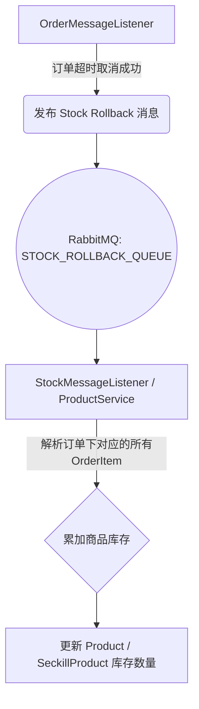

# 订单模块库存泄露问题分析与修复方案

## 1. 发现的问题 (Issue Identification)

在目前的代码实现中，对于超时未支付的订单处理存在**严重的业务缺陷**。
涉及代码文件：`eden-service/src/main/java/eden/service/listener/OrderMessageListener.java`

当前在监听 `ORDER_CANCEL_QUEUE`（订单超时取消延迟队列）时，如果订单状态为“待付款”，系统仅仅执行了：
```java
updateOrder.setStatus(OrderConstants.STATUS_CANCELLED);
orderMapper.updateById(updateOrder);
```
然后留下了如下注释：
```java
// TODO: 恢复库存（发送库存回滚消息）
```

**问题本质：库存泄露 (Stock Leakage)**
用户在下单时（或甚至加购秒杀时），系统已经进行了“预扣库存”操作（减扣了对应的 `Product` 真实库存）。当订单超时未支付自动取消时，如果只修改了订单表的状态为取消，**却没有把扣减的库存加回去**，那么这部分商品库存将永远“锁死/蒸发”，导致即使有真实的买家想买也无法购买，直接影响平台销售和营收。

---

## 2. 问题分析与影响

1. **恶意的库存占用（黄牛行为）**：黑灰产可以使用脚本大量下单但不付款。几十分钟后订单虽然被系统自动取消，但由于没有库存回归逻辑，整个商城的商品会被瞬间“搬空”锁死。
2. **数据一致性破坏**：数据库中订单明细的销量加总加上现存余量，可能不等于商品在系统初始设定的库存总量。
3. **秒杀场景崩溃**：秒杀的商品数量往往极少，库存未回归会导致原本未卖出的秒杀份额被作废，秒杀活动未达到预计发售量。

---

## 3. 具体修复方案 (Fix Proposal)

要在 `OrderMessageListener` 的这个 `TODO` 处把库存补回来。考虑到分布式微服务（或不同模块）的解耦，最佳的方式是向 `StockMessageListener` 或 商品服务发出一条 **库存回滚 (Rollback) 消息**。

### 3.1 方案架构：基于 MQ 的最终一致性 


### 3.2 代码落地示例

**步骤 1：补齐商品明细查询**
在 `OrderMessageListener` 中的取消逻辑后，查出这个订单到底买了什么：
```java
List<OrderItem> orderItems = orderItemMapper.selectByOrderId(order.getId());
// 组装回滚消息对象，例如包含 productId, skuId, quantity 的列表
```

**步骤 2：发送消息到库存回滚队列**
```java
rabbitTemplate.convertAndSend(
    MQConstants.STOCK_EXCHANGE, 
    MQConstants.STOCK_ROLLBACK_ROUTING_KEY, 
    orderItems
);
```

**步骤 3：在消费端(`StockMessageListener`/`ProductService`) 监听并更新**
```java
@RabbitListener(queues = MQConstants.STOCK_ROLLBACK_QUEUE)
public void handleStockRollback(List<OrderItem> items) {
    for (OrderItem item : items) {
        // SQL层面：UPDATE product SET stock = stock + item.quantity WHERE id = item.productId
        productMapper.increaseStock(item.getProductId(), item.getQuantity());
    }
}
```

### 4. 结论与修复状态 (Conclusion & Fix Status)
这是一个直接影响核心电商交易链路（订单-库存一致性）的 **P0 级 Bug**。

**修复状态（2026-03-31）**：✅ **已修复 (Fixed)**
- 已成功在 `OrderMessageListener` 中移除了 TODO，并注入了 `OrderItemMapper` 和 `RabbitTemplate`。
- 当前在监听到订单取消消息时，系统会查询订单对应的 `OrderItem`，并为每一个订单项单独生成 `Map<String, Object>` 回滚消息，发送到 `eden.stock.exchange` 和 `eden.stock.rollback.key`。
- `StockMessageListener` 无需改动，已具备监听此对列并调用 `productMapper.addStock` 进行底层真实库存补回的逻辑。整个“自动取消订单 -> 回退商品库存”的闭环已经彻底打通。
